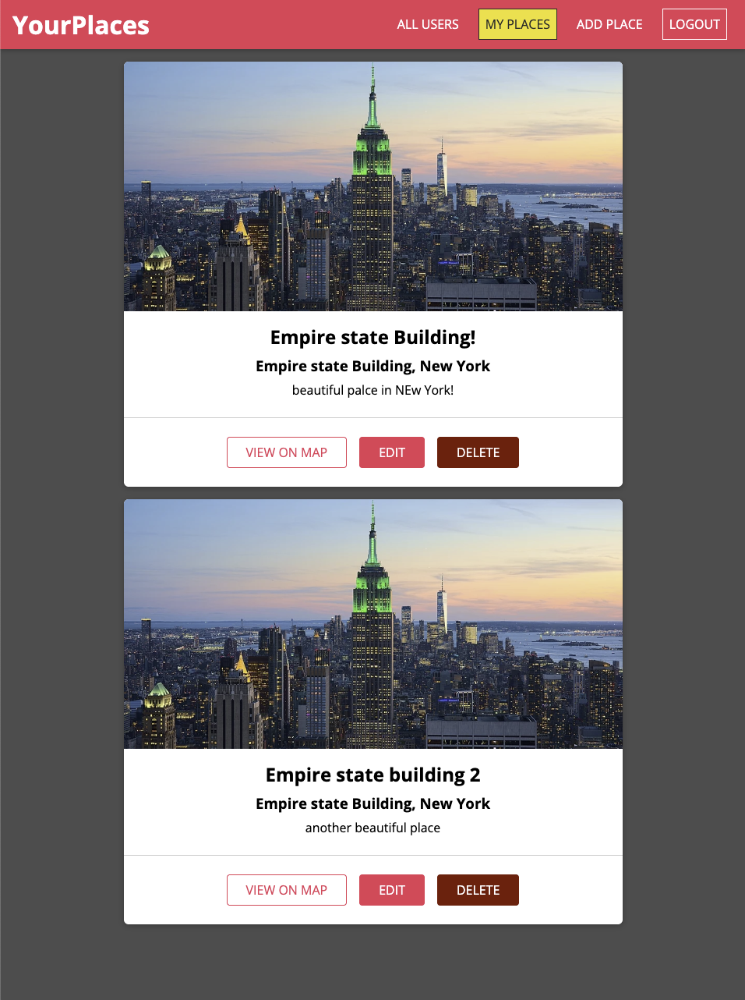

# React Places Manager

## Descrizione

React Places Manager è un'applicazione frontend sviluppata con React.js che consente agli utenti di registrarsi, autenticarsi (login/logout) e gestire i propri "places" (luoghi). Gli utenti possono creare, modificare o eliminare luoghi personalizzati, con dati memorizzati e sincronizzati tramite backend.

Questo progetto nasce per esercitarsi con React, autenticazione JWT, routing protetto, gestione dello stato e interazione CRUD.

---

## Funzionalità principali

- Registrazione e autenticazione utenti con login/logout
- Creazione, modifica ed eliminazione di places personali
- Visualizzazione lista di places per utente
- Protezione delle rotte tramite autenticazione
- Upload e gestione immagini associate ai places
- Routing dinamico e navigazione fluida con React Router
- Gestione globale dello stato autenticazione tramite Context API

---

## Tecnologie utilizzate

- React.js (Hooks, Context API)
- React Router DOM
- JWT per autenticazione (gestito nel backend)
- CSS Modules / styling personalizzato
- Backend API REST (Node.js, Express, MongoDB) — non incluso in questo repository

## Installazione

1. Clona il repository

```bash
git clone https://github.com/FedericoPiazzolla/react-places.git
```

2. Entra nella cartella progetto

```bash
cd react-ecommerce
```

3. Installa le dipendenze

```bash
npm install
```

## Uso

- Registrati o accedi con un account esistente
- Visualizza la lista dei tuoi places
- Aggiungi nuovi places con titolo, descrizione, indirizzo e immagine
- Modifica o elimina i places creati
- Effettua il logout per terminare la sessione

## Note personali

Durante lo sviluppo di questa applicazione ho approfondito:

- L'integrazione di autenticazione JWT in frontend React
- La protezione di rotte con gestione dinamica dei permessi
- La gestione dello stato globale tramite Context API
- La manipolazione di file (upload immagini) in React
- Le transazioni CRUD sincronizzate con backend MongoDB


